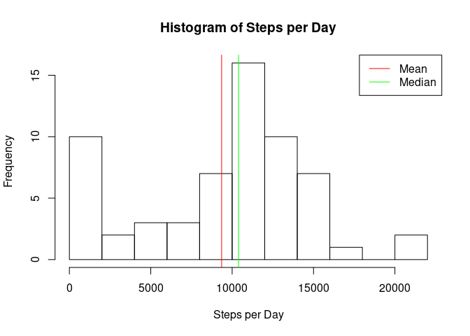
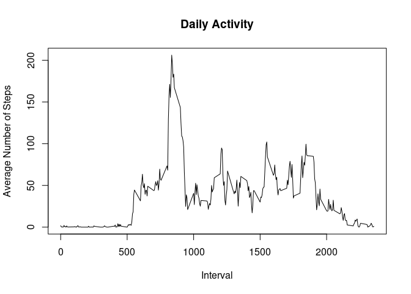
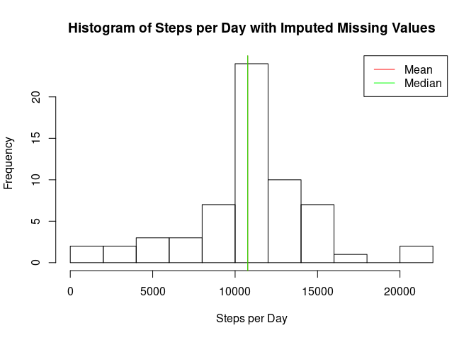
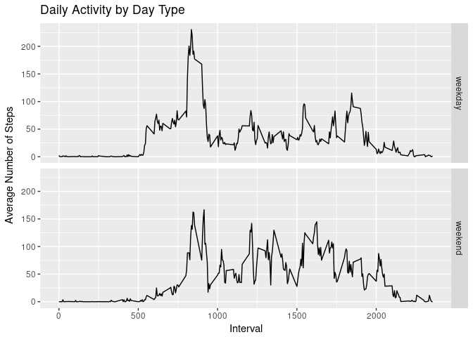

# Reproducible Research: Peer Assessment 1


```r
library(knitr)
#set scipen=1, to avoid scientific notation of certain results in the report
options(scipen=1)
#set path to keep generated figures
opts_chunk$set(fig.path='figure/')
```

## Loading and preprocessing the data


```r
library(lubridate)
unzip(zipfile="activity.zip")
activity <- read.csv("activity.csv",header=TRUE)
activity <- transform(activity,date=ymd(date))
```

The zip archive is unzipped, and the data set it contains is read into R using *read.csv()*. We transform the *date* column of the resulting dataframe to date objects using the *lubridate* package.

## What is mean total number of steps taken per day?


```r
#calculate the sum of steps for each date
steps.per.day <- with(activity,tapply(steps,date,sum,na.rm=TRUE))
#calculate mean and median
mean.steps.per.day <- mean(steps.per.day)
print(mean.steps.per.day)
```

```
## [1] 9354.23
```

```r
median.steps.per.day <- median(steps.per.day)
print(median.steps.per.day)
```

```
## [1] 10395
```

```r
#plot histogram of total steps per day
hist(steps.per.day, main="Histogram of Steps per Day",xlab="Steps per Day",breaks=10)
abline(v=mean.steps.per.day,col="red")
abline(v=median.steps.per.day,col="green")
legend("topright",lty=1,col=c("red","green"),legend=c("Mean","Median"))
```

<!-- -->

The mean number of steps per day was calculated to be 9354.23. The median number of steps per day is 10395.  

## What is the average daily activity pattern?

```r
#calculate the mean of steps per interval
daily.activity <- aggregate(steps~interval,activity,mean,na.rm=TRUE)
#plot the daily activity (=mean of steps for each interval)
plot(daily.activity,type="l",main="Daily Activity",xlab="Interval",ylab="Average Number of Steps")
```

<!-- -->

```r
#find the interval with maximum average number of steps
max.interval <- daily.activity[which.max(daily.activity$steps),]$interval
print(max.interval)
```

```
## [1] 835
```

The interval with the maximum average number of steps was calculated to be 835.

## Imputing missing values

```r
library(dplyr)
#find which columns have NA's
sapply(activity, anyNA)
```

```
##    steps     date interval 
##     TRUE    FALSE    FALSE
```

```r
#calculate how many rows have NA's
na.rows <- sum(is.na(activity$steps))
print(na.rows)
```

```
## [1] 2304
```

```r
#impute NA values by replacing them with the average number of steps for the corresponding interval
impute.mean <- function(x) replace(x, is.na(x), mean(x, na.rm = TRUE))
activity.impute <- activity %>%
    group_by(interval) %>%
    mutate(steps=impute.mean(steps)) %>%
    ungroup
#calculate the sum of steps for each date
steps.per.day.impute <- with(activity.impute,tapply(steps,date,sum))
#calculate mean and median
mean.steps.per.day.impute <- mean(steps.per.day.impute)
print(mean.steps.per.day.impute)
```

```
## [1] 10766.19
```

```r
median.steps.per.day.impute <- median(steps.per.day.impute)
print(median.steps.per.day.impute)
```

```
## [1] 10766.19
```

```r
#plot histogram of total steps per day
hist(steps.per.day.impute, main="Histogram of Steps per Day with Imputed Missing Values",xlab="Steps per Day",breaks=10)
abline(v=mean.steps.per.day.impute,col="red")
abline(v=median.steps.per.day.impute,col="green")
legend("topright",lty=1,col=c("red","green"),legend=c("Mean","Median"))
```

<!-- -->

We look which of the columns have missing values, it turns out only the *steps* column has these. We then count the number of missing values in this column, which turns out to be 2304.  
Next we impute the missing values. We do this by assigning to each missing *steps* value the mean of the corresponding 5-minute interval.  
We then calculate the mean and median of the total steps per day, which turned out to be identical, and have a value of 10766.19. This value is larger than the ones found previously. The increase in the median is not very large, but the mean increases significantly. The fact that the mean and median are identical, points to a more symmetric distribution of values, something which is confirmed by the histogram of total steps.


## Are there differences in activity patterns between weekdays and weekends?

```r
library(ggplot2)
#indices of days of the weekend
weekend=c(1,7)
#add daytype column, assign "weekend" or "weekday" appropiately and make daytype into a factor variable
activity.impute <- activity.impute %>%
    mutate(daytype=ifelse(wday(date) %in% weekend,"weekend","weekday")) %>%
    mutate(daytype=factor(daytype))
#calculate the average number of steps for each interval and daytype
activity.by.daytype <- aggregate(steps ~ interval + daytype,activity.impute,mean)
#plot the daily activity by daytype
qplot(interval,steps,data=activity.by.daytype,facets=daytype~.,geom="line",main="Daily Activity by Day Type",xlab="Interval",ylab="Average Number of Steps")
```

<!-- -->

We can observe a clear difference in activity patterns between weekdays and weekends.
